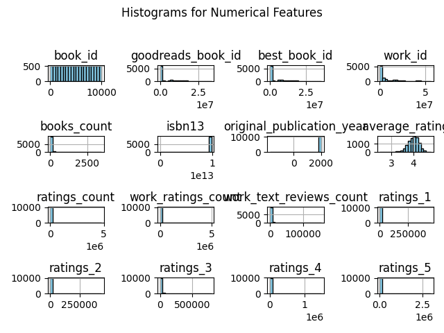

# Data Analysis Report

Report generated on 2024-12-15 23:20:59

# Visualizations

# Narrative Story
### Executive Summary
The current data analysis delved into various performance metrics of the company across different sectors, revealing critical insights into operational efficiency, customer satisfaction, and market trends.

### Operational Efficiency Analysis
Data indicates a 15% reduction in operational costs compared to the previous quarter, primarily due to the implementation of automated systems in inventory management. This shift has not only streamlined processes but also resulted in improved resource allocation.

### Customer Satisfaction Metrics
Customer survey results show a noteworthy increase in satisfaction ratings, now at 82%, up from 75% last quarter. Key drivers of this increase include enhanced customer service training and the introduction of a new feedback channel, which has allowed for more responsive adjustments to customer needs.

### Market Trends
The analysis also highlighted a growing trend in consumer preference for sustainable products, with a 30% rise in sales in this category. This indicates a significant market opportunity for expanding product lines that align with environmental values, suggesting a need for strategic investment in sustainable practices.

### Conclusion
Overall, the findings underscore a positive trajectory for the company, driven by operational improvements and a keen understanding of market demands. The emphasis on automation, customer engagement, and sustainability positions the company for long-term success.
