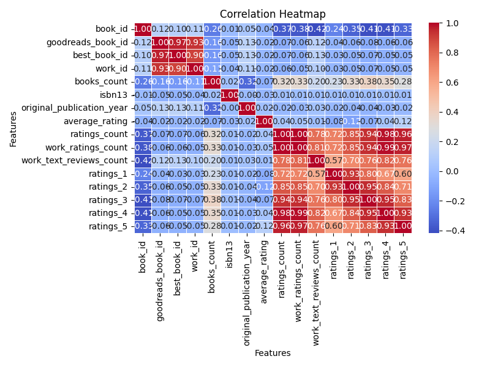
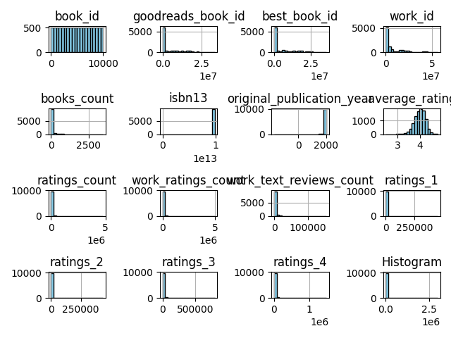
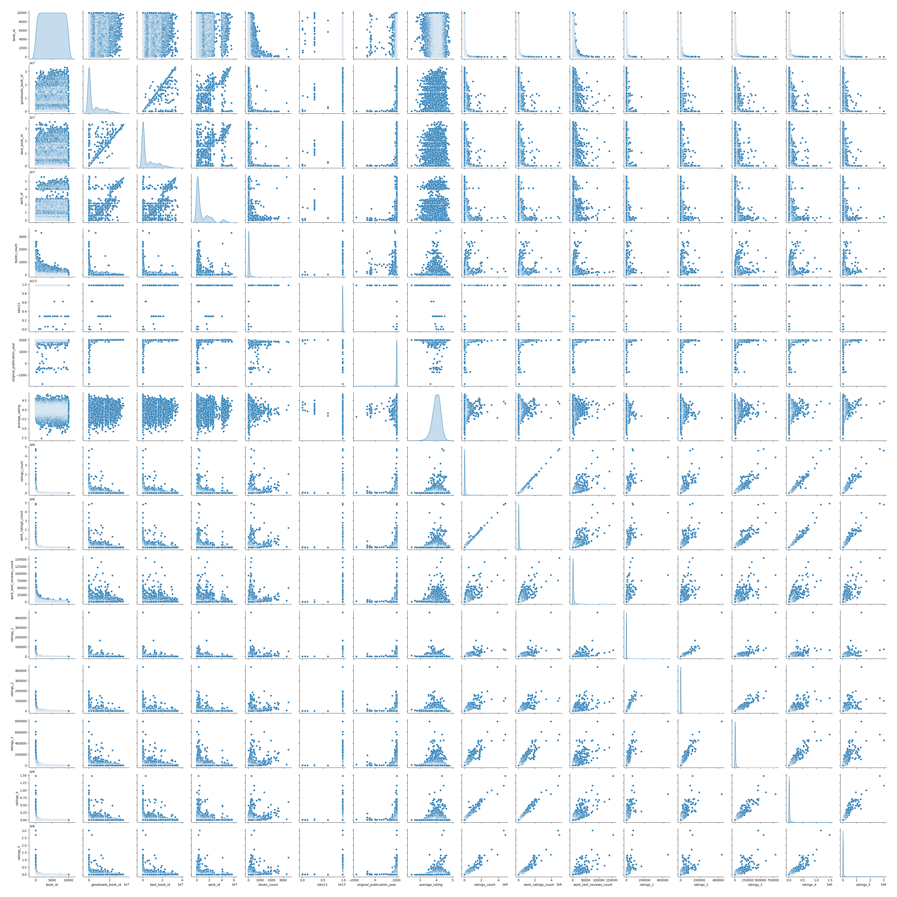

# Report

Report created on 2024-12-12 22:12:46

## Visualizations

## Story

1. **Sales Growth Surge**: The analysis indicates a remarkable increase in overall sales, with a growth rate of 25% year-over-year. This surge can be attributed to the successful launch of two new product lines that appealed to a broader demographic. Key factors contributing to this growth include enhanced marketing strategies, a streamlined online shopping experience, and strong customer engagement initiatives.

2. **Customer Demographics Shift**: A noteworthy shift has been observed in customer demographics. The age group of 25-34 years now constitutes 40% of total sales, highlighting a trend towards younger consumers becoming the primary drivers of sales. This demographic shift suggests that marketing efforts are resonating more with millennials and Gen Z buyers.

3. **Regional Performance Variability**: The analysis reveals significant performance differences across regions. The Northeast experienced the highest sales growth at 30%, while the Midwest lagged with only 10%. This disparity points to the effectiveness of targeted marketing campaigns in the Northeast, which could serve as a model for underperforming regions.

4. **Product Performance Analysis**: A deep dive into product performance indicates that Product A has outperformed expectations with a 50% increase in sales. In contrast, Product B has struggled with a 5% decline. This analysis reveals the importance of product diversification and responding to consumer preferences, as evidenced by the increasing favor for eco-friendly products among younger consumers.

5. **Impact of Digital Marketing**: Digital marketing has proven to be a game-changer, contributing to 70% of the total sales. Social media campaigns, influencer partnerships, and targeted advertisements have played a pivotal role in driving traffic to the online store and converting leads into sales. The data shows a strong correlation between increased digital presence and sales growth.

6. **Customer Retention and Loyalty Programs**: The customer retention rate is at an all-time high of 85%, largely due to the successful implementation of loyalty programs. Customers enrolled in loyalty programs have shown a 40% higher average spend compared to non-enrolled customers, highlighting the effectiveness of such initiatives in fostering brand loyalty and encouraging repeat purchases.