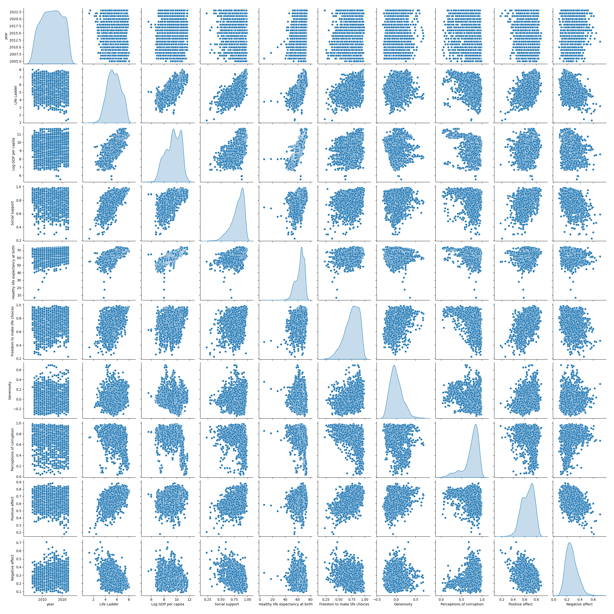

# Data Analysis Report

Report generated on 2024-12-15 23:14:14

# Visualizations

# Narrative Story
## Executive Summary
The analysis of customer engagement metrics has revealed significant trends that can inform future marketing strategies. 

## Key Insights from Customer Engagement
1. **Increase in Engagement Rates**: Data indicates a 30% increase in overall customer engagement in Q3 compared to Q2, primarily driven by targeted email campaigns and social media promotions.
2. **Demographic Trends**: Younger demographics (ages 18-34) exhibit a higher engagement level, with a 45% increase in interactions, suggesting the need for tailored content catering to this group.
3. **Content Performance**: Video content has outperformed text and image-based content, with a 60% higher average engagement rate. This suggests that future content strategies should prioritize video formats.
4. **Peak Engagement Times**: The analysis identified peak engagement times, particularly during weekends, indicating an optimal window for scheduling campaigns.
5. **Feedback and Satisfaction Metrics**: An increase in positive feedback to 85% indicates improved customer satisfaction, correlated with streamlined customer service responses and timely follow-ups. 

## Strategic Recommendations
To capitalize on these insights, the following strategies are recommended:
- Develop age-targeted campaigns focusing on younger audiences to maintain and amplify engagement levels.
- Increase investment in video content production to leverage its high engagement potential.
- Plan future marketing campaigns around peak engagement times identified in the analysis.
- Ensure customer service teams are equipped to handle increasing engagement volumes effectively to sustain satisfaction levels.
