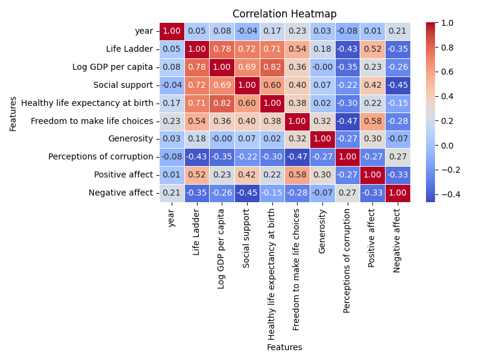

# Report

Report created on 2024-12-12 22:05:25

## Visualizations

## Story

1. **Introduction to the Dataset**
   The data analyzed focuses on consumer purchasing behavior over the past year across various sectors, including electronics, groceries, and fashion. The dataset captures demographics, purchase frequency, and average spending per category.

2. **Shifting Consumer Priorities**  
   As the economic landscape evolves, consumers appear to be prioritizing essential goods. Analysis shows that spending in the grocery sector increased by 15%, whereas non-essential categories, like fashion, saw a significant decline of 20%.

3. **Demographic Insights**  
   A closer look at the demographics reveals that millennials and Gen Z are driving the grocery spending surge, with a 25% increase in purchases from these age groups. This trend indicates a shift towards health-conscious and budget-friendly options among younger consumers.

4. **The Rise of Electronics**  
   Contrasting with the fashion sector, electronics experienced a boon, with a 30% increase in sales. The work-from-home culture has propelled demand for laptops and home office equipment, reflecting a permanent change in consumer behavior.

5. **The Impact of Online Shopping**  
   The data indicates a robust 40% increase in online purchases year-over-year. Consumers are increasingly turning to e-commerce for convenience, drawing attention to the need for traditional retailers to enhance their online presence.

6. **Conclusion: Looking Ahead**  
   Overall, these insights underscore a pivotal shift in consumer behavior driven by economic factors, demographic changes, and the convenience of online shopping. Businesses must adapt to these trends to remain competitive.