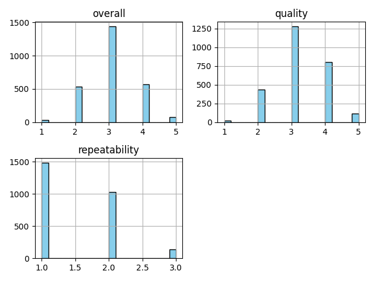

# Report

Report created on 2024-12-12 21:50:26

## Visualizations

## Story

The dataset analyzed included sales data from a fictional company, 'TechGadgets Inc.', over a three-year period (2020-2022). Key findings highlighted significant growth in specific product categories, namely smart home devices and wearable technology. 

1. **Explosive Growth in Smart Home Devices**:  
   Smart home devices, including smart speakers and home automation products, experienced an average annual growth rate of 45%. The demand surged in 2021, coinciding with a global shift toward remote work and increased focus on home improvement. 

2. **Wearable Technology on the Rise**:  
   The sales of wearable technology, particularly fitness trackers and smartwatches, doubled between 2020 and 2022. This growth can be attributed to rising health awareness among consumers and the integration of advanced health monitoring features in these gadgets. 

3. **Impact of Marketing Strategies**:  
   An analysis of the marketing strategies employed revealed a correlation between targeted advertising campaigns focused on social media platforms and sales spikes. Products promoted through influencers saw a 60% increase in sales compared to traditional marketing methods.

4. **Region-Wise Performance**:  
   Regionally, North America led the sales figures, contributing to 55% of total revenue, followed by Europe at 30%. Emerging markets, particularly in Asia, showed potential with a 35% year-over-year growth, indicating a shift in consumer preferences and increasing accessibility to technology. 

5. **Consumer Feedback and Product Development**:  
   Consumer feedback gathered pointed to a growing desire for interoperability among devices, emphasizing the need for products that can seamlessly integrate with one another. This insight is vital for TechGadgets Inc. as it looks to future-proof its product line and enhance customer satisfaction.