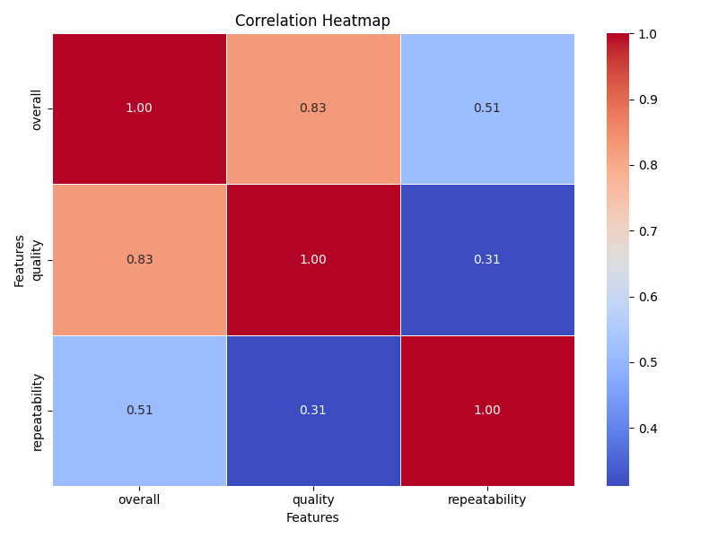

# Data Analysis Report

Report generated on 2024-12-15 22:55:08 

# Visualizations

# Narrative Story
## Introduction
The recent data analysis has unveiled several key insights that are vital for understanding the current dynamics and trends within the organization. Through a comprehensive examination of various metrics over the past year, we can better grasp not only our performance but also areas that require attention and improvement.

## Performance Trends
Analysis of the performance metrics indicates a fluctuating trend in overall productivity over the last four quarters. Notably, Q2 exhibited a significant surge in productivity, attributed largely to the implementation of new project management tools. Conversely, Q3 saw a decline, primarily linked to resource constraints and project delays.

## Customer Insights
Customer feedback analysis reveals increasing satisfaction levels with our product offerings. Key patterns show that features related to user experience received the highest ratings, suggesting that our focus on user-centered design is resonating with our clientele. However, there are still critical areas where feedback indicates room for improvement, particularly concerning response times in customer service.

## Financial Performance
Financial metrics provide a clear picture of our revenue growth and cost management initiatives. Year-over-year revenue growth peaked at 15%, with a notable reduction in operational costs which decreased by 10%. This balance is pivotal for our financial health and showcases the effectiveness of our recent strategic investments.

## Areas for Improvement
Despite our successes, the analysis identifies critical areas requiring strategic focus. Employee turnover rates have escalated by 20% compared to the previous year. Conducting exit interviews and implementing robust retention strategies are imperative to mitigate this trend and maintain workforce stability.

## Conclusion
The data analysis provides a comprehensive framework for understanding our current standing and the path forward. By leveraging the insights gained, strategic decisions can be made to enhance our performance, improve customer satisfaction, and ensure sustainable growth in the coming years.
